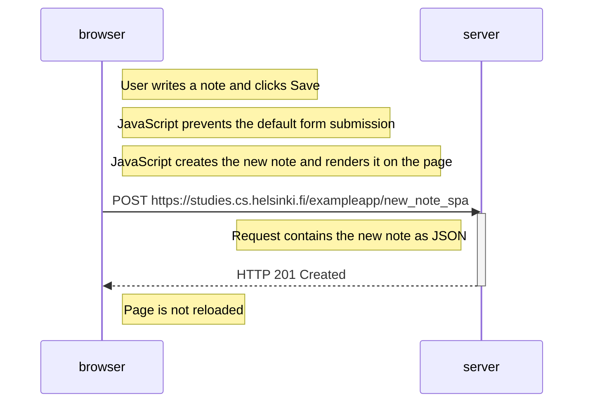

# Exercise 0.6 — Creating a note in the SPA

```mermaid
sequenceDiagram
    participant browser
    participant server

    Note right of browser: User writes a note and clicks Save

    Note right of browser: JavaScript prevents the default form submission

    Note right of browser: JavaScript creates the new note and renders it on the page

    browser->>server: POST https://studies.cs.helsinki.fi/exampleapp/new_note_spa
    activate server

    Note left of server: Request contains the new note as JSON

    server-->>browser: HTTP 201 Created
    deactivate server

    Note right of browser: Page is not reloaded
```
